## Introduction

BitTorrent remains one of the most resilient and scalable P2P networks in the world, yet its internal workings -- the DHT, exchange protocols, behavioral signatures -- remain largely unexplored in the context of OSINT analytics. Most existing work either describes the protocol at an abstract level, focuses on detecting pirated content, or optimises network algorithms. However, there is practically no systematic, hands‑on approach to using the DHT as an intelligence source with clear risk indicators, enrichment methodologies, and visualisation techniques.

This research is an attempt to fill that gap. The work covers in detail: the Kademlia protocol and its BitTorrent implementation; passive and active data collection methods; IP address enrichment with geolocation, provider info, and reputation scores; graph models for detecting clusters of coordinated activity; and temporal patterns that help distinguish normal behaviour from automated activity.

**The work is aimed at InfoSec professionals, law enforcement officers, OSINT enthusiasts, and anyone who faces the pressing need to investigate decentralised networks -- a topic that remains largely undisclosed and understudied by its very nature.**

---

## General Material
### Architecture

When we launch a BitTorrent client, the first thing it does is generate a 160‑bit node ID. Theoretically, it should be random, but in practice many implementations use deterministic algorithms to preserve their position in the DHT space across restarts. Some clients, like *Transmission*, simply take the SHA1 of a combination of IP address and port, making their nodes easily predictable. This ID determines the node's place in a two‑dimensional -- or rather 160‑dimensional -- logical space, where distance is defined as the bitwise XOR of two numbers, interpreted as an unsigned integer. This metric has the property that the distance between any two nodes is always less than 2^160, and it does not depend on geographic location, only on random numbers.

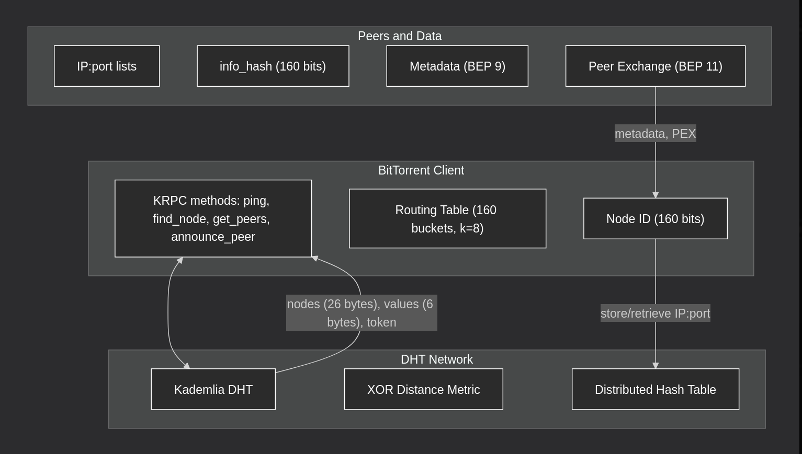

After generating the ID, the node tries to join the network. To do so, it contacts bootstrap nodes hardcoded into the client, such as `router.bittorent.com`, `dht.transmissionbt.com`, `router.utorrent.com`, and a few others. Once it establishes a connection with at least one of them, the node sends a `find_node` request, passing its own ID and a target ID -- initially a random one to obtain a set of neighbours. The response contains up to eight compact entries, each of which is 26 bytes: 20 bytes of node ID, 4 bytes of IPv4 address, and 2 bytes of port. Having received this list, the node places them into a table organised as an array of 160 buckets. Each bucket covers a specific distance range from the node's own ID: bucket index `i` contains nodes whose distance lies between 2^i and 2^(i+1). Inside each bucket, at most eight entries are stored, sorted by the time of last contact. The oldest ones are evicted when the bucket overflows, replaced by newer ones, and so on cyclically. This is the classic Kademlia structure, which guarantees that searching for any key takes no more than O(log N) steps, where N is the number of nodes in the network -- roughly 160 steps for a full‑sized network.

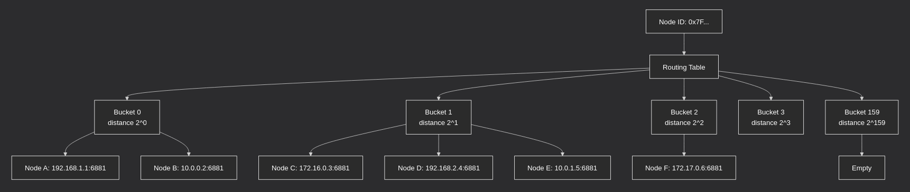

Requests and responses in the DHT are packed into UDP datagrams using the simple KRPC protocol, which serialises data in Bencode -- the same format as in torrent files, but without top‑level dictionaries. Each message contains a transaction ID, a type (request, response, or error), and for requests -- the method name and a dictionary of arguments. There are only four methods: `ping`, `find_node`, `get_peers`, and `announce_peer`. `ping` is a liveness check, sent periodically to update buckets and evict dead entries. `find_node` is used not only for bootstrapping but also as the primary routing tool. In other words, when a client wants to find peers to connect to, it first locates the nodes closest to the target `info_hash`, and only then asks them for a peer list via `get_peers`.

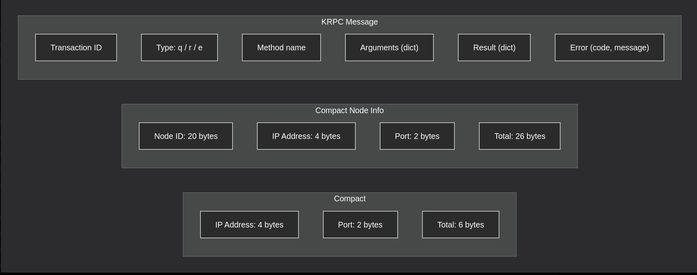

Interestingly, `get_peers` and `find_node` have nearly identical request structures -- the only difference is that `get_peers` expects a response containing either a `values` field with peer IP addresses or a `nodes` field with closer nodes. If a node does not know any peers for a given `info_hash`, it returns a list of nodes that are closer to that key, and the client continues iterating. This makes peer discovery fully decentralised and censorship‑resistant, because even if one node refuses to answer, the client can reach out to others.

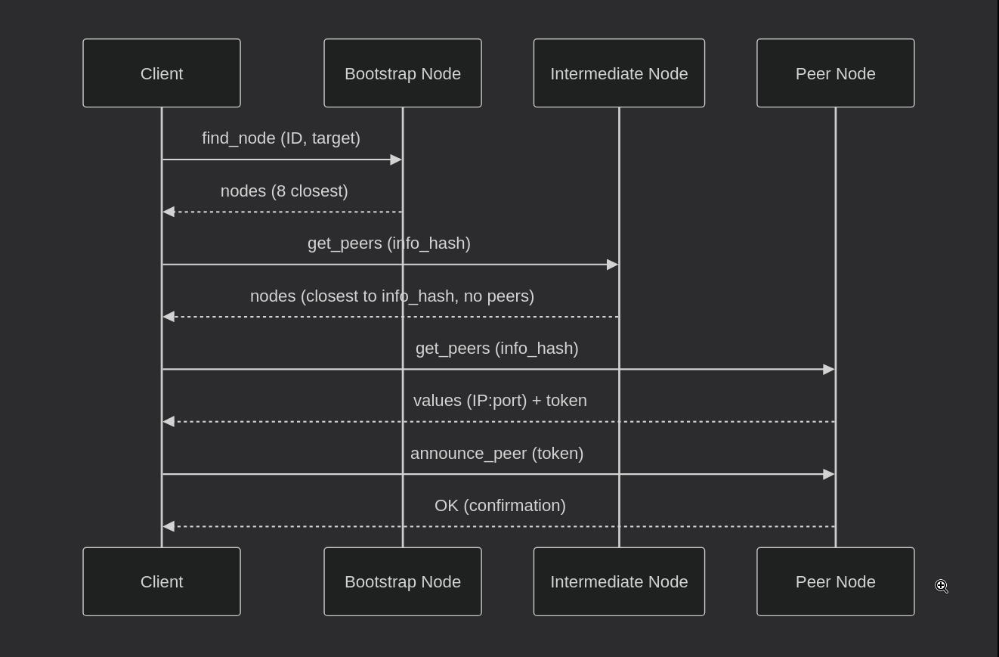

The most interesting aspect is `announce_peer`, which allows a node to announce itself as a seeder or leecher for a specific torrent. But you cannot announce just like that: you first have to perform `get_peers` and obtain a token from the node. The token, simply put, is a special string that the node generates based on its secret key and the current time. In `announce_peer`, the client sends this token back, the node validates it, and then adds the client's IP and port to its local peer table for that `info_hash`. The token is valid for a limited time, typically about a minute, which prevents forged announcements. This mechanism allows collecting activity statistics, but from an intelligence perspective it is valuable because the frequency of `announce_peer` can reveal real‑time popularity dynamics of a torrent.

Now, about the extensions that significantly change the network's behaviour. **BEP 9**, also known as Metadata Exchange, allows a client to obtain the full `.torrent` file using only the `info_hash`, without visiting a website. This is achieved via the `ut_metadata` extension, which runs over a TCP connection between peers. When a client finds a peer, it can request metadata from it: file name, size, piece list, and then start downloading without an external tracker. From an OSINT standpoint, this means we can learn file names from `info_hash`, providing context rather than just a hash.

**BEP 11**, Peer Exchange, lets peers exchange lists of other peers directly, bypassing both the DHT and trackers. This speeds up peer discovery and makes the network even more robust. For an analyst, this means that even if DHT queries are blocked, peers may continue to communicate via PEX, though it is harder to monitor.

The most important extension for data collection is **BEP 51** (DHT Infohash Indexing). It allows querying not only peers for a specific `info_hash`, but also `sample_infohashes` -- a sample of all `info_hash` values stored by the nearest nodes. This turns the DHT into a kind of torrent search engine, where you can collect a catalogue of all active swarms without a full network traversal. Crawlers like *dht-spider* use this extension to constantly scan the network and record every `info_hash` they encounter, then fetch metadata via **BEP 9**.

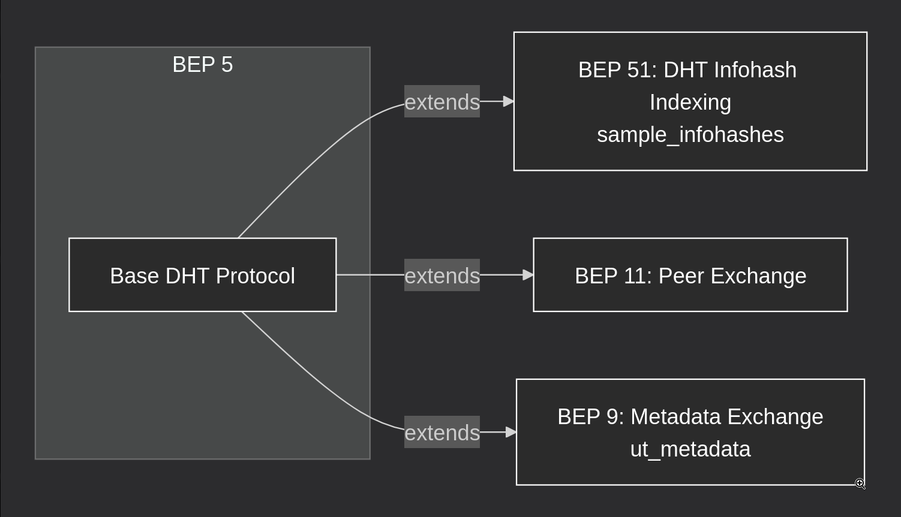

Now, how this all looks at the UDP packet level. The size of each message is limited by the MTU, typically 1400 bytes for Ethernet, to avoid fragmentation. Therefore, in `get_peers` responses, nodes transmit a compact representation of peers: every 6 bytes contain an IP and port, with no extra information. For nodes, they use 26 bytes. This allows packing up to 50 entries into a single packet, which is sufficient for bootstrapping.

For an analyst, understanding the architecture provides many entry points, which is exactly why I started with this topic. In the main article, I covered only a small piece of a very simplistic view of the torrent architecture.

Now, about those entry points. First, you can passively listen to UDP traffic on port 6881 to see all outgoing requests from your local node and all incoming responses from other nodes. This lets you map your nearest neighbours and their behaviour. Second, you can actively poll the DHT, using the same methods as clients, but with the goal of collecting statistics. For example, you can send `get_peers` for popular `info_hash` values, record the IPs of the peers, then enrich them with geolocation via external API services and identify anomalies (this is the method I described in the main article).

A key limitation is that the DHT does not return all peers, only a random sample. Therefore, to obtain a full picture, you need to repeat the queries from multiple nodes and merge the results. Researchers from Tilburg University showed that for popular torrents, you can collect up to 80% of all existing peers by querying 50 nodes.

Also worth noting is that the Node IDs of some clients are not fully random. For instance, older versions of *uTorrent* and *BitComet* used identifiers starting with prefixes that can be mapped to client versions. This allows us to estimate market shares of various clients and their behavioural patterns.

---

### Data Collection Methods

When I started working with the DHT not from documentation but in the wild, the first thing that struck me was the gap between how the network is described in specs and how it behaves under load. Theoretically, Kademlia guarantees O(log N) search, but in practice, the number of dead nodes, fake responses, and simply silent peers turns this process into an iterative battle with uncertainty. Yet this very uncertainty becomes the primary driver for bringing OSINT discipline into the picture.

The two main types of data that the DHT provides are peer IP addresses and `info_hash` values. And there is a fundamental difference between them, which many (though not all) forget: `info_hash` is a static identifier. It does not change as long as the torrent exists. An IP address, on the other hand, is dynamic and tied to a node at a specific moment. And it is precisely this tie that makes data collection valuable: via IP we get geography, provider, and much more, while through request history we get behaviour.

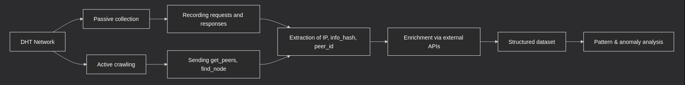

But here is an interesting observation. If you look at the distribution of IP addresses in a typical `get_peers` response, you notice a consistent pattern. About 60–70% of addresses belong to hosting providers, not home users. This means that most peers in the DHT are not people, but servers running torrent clients. For us, this is a double signal: on one hand, the data becomes less personalised; on the other, we gain access to stable, predictable nodes that we can study for months as needed.

I tried several collection approaches. The first was polling popular UDP trackers that return announce lists. This gives clean data because trackers, unlike the DHT, store structured peer lists. But there is a problem: public trackers die, get blocked, or change addresses. And at that point, the DHT remains the only stable and up‑to‑date source, which is quite convenient.

The second approach was to join the network as an ordinary node and log all incoming traffic. I used *dht-spider* in passive listening mode and found (if the images load, I'll attach the whole work with *dht-spider*. PS: screenshots didn't load in the commit) that even without active queries, my node received hundreds of `get_peers` and `announce_peer` requests from other peers. These requests contain IP addresses and hashes. Key point: passive collection gives a non‑random sample, because you only record those queries that pass through your neighbour. But if you have several nodes in different subnets, the picture becomes representative.

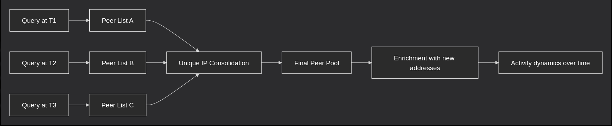

The third approach is active crawling, where you initiate `get_peers` for known hashes yourself. This gives a more complete list of peers, but it creates load on the network. I noticed that if you send queries more often than once a minute, nodes start responding with delays or even ignoring you. It seems that some DHT implementations have protection against scanning: they remember aggressive peers and lower their priority. I had to empirically adjust the interval to 5–10 seconds between requests to not lose data but also avoid getting banned.

Over several weeks of observation, I identified three types of signals that are not documented but appear regularly in practice.

The first type of signals I'll describe as `peer_id` anomalies -- more precisely, anomalies in that field. According to the spec, it should be 20 random bytes, but I routinely see clients with predictable prefixes. For example, `-TR` for *Transmission*, `-UT` for *uTorrent*, `-DE` for *Deluge*. This is not a violation, just a convention, but it allows identifying not only the client but also, more interestingly, the version. In DHT data, the share of clients with non‑standard `peer_id` (not Azureus‑style) is growing. These are either custom builds, modified clients, or bots. For OSINT this is a valuable signal, because if you see many non‑standard `peer_id` on a single torrent, it might be coordinated activity.

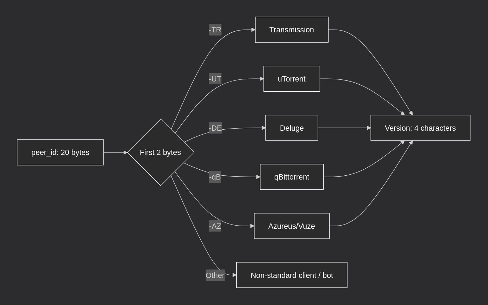

The second signal is the frequency of `announce_peer`. A normal peer announces itself every 30–60 minutes, but in my data I saw nodes that did it every 5–10 minutes. Such activity is typical for automated systems or for peers with unstable connections that keep reconnecting. But I noticed a correlation: on torrents with a high `abuse_score` (checked via external *AbuseIPDB* API), the `announce_peer` frequency was above average. This suggests that peers with suspicious behaviour behave differently from ordinary users.

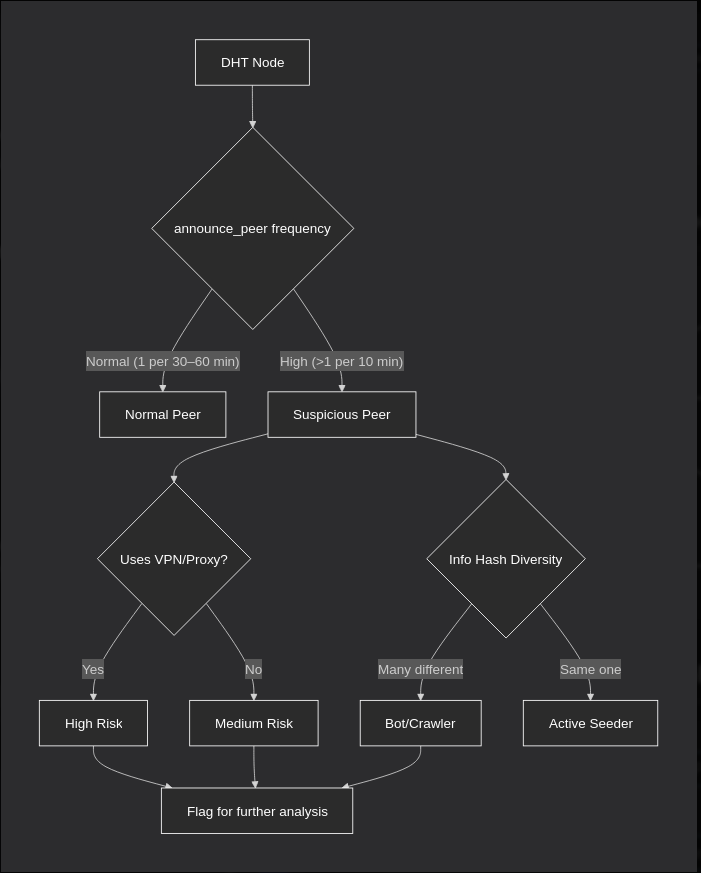

The third signal is the record lifetime in the DHT. When I repeated `get_peers` for the same hash at 15‑minute intervals, I saw that the peer list refreshed by about 40–50%. This means that data in the DHT is very dynamic, and any study based on a single snapshot gives a distorted picture. But it is precisely this dynamics that allows tracking changes: if a popular torrent suddenly loses peers or, conversely, gains them sharply, it may indicate an external event -- a block, a new release, or an attack.

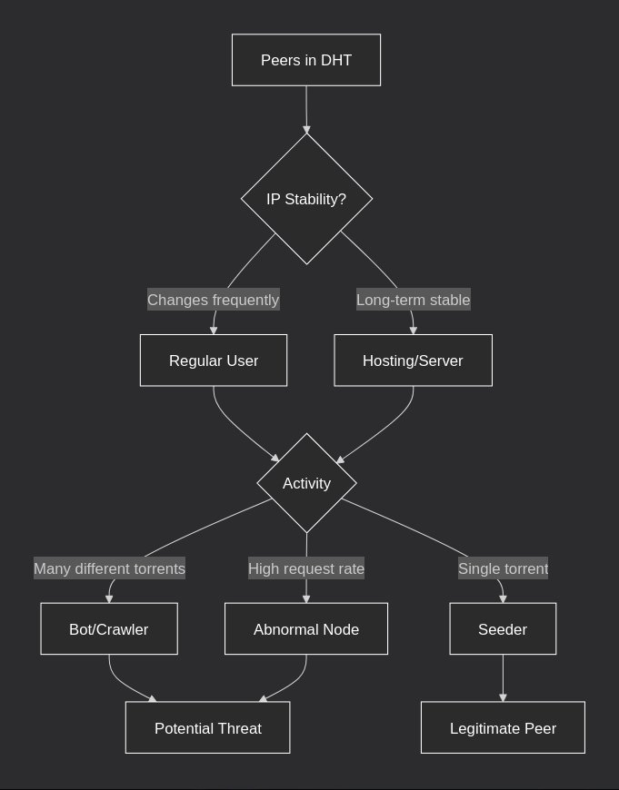

--- 

### Interpretation

When we have a dataset with IP addresses, `info-hash`, `peer_id`, and timestamps, the real work begins. Raw data is just noise if you cannot extract signals from it. In this section, I will describe the analysis methods that have proven effective in practice, and the patterns that truly matter for OSINT.

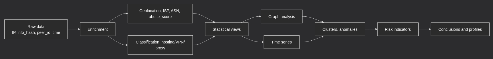

An IP address, as we know, is useless by itself. Its value appears when you know who owns it, where it comes from, and what reputation it has. I used three main enrichment sources: geolocation via public databases, provider and ASN info, and reputation services like *AbuseIPDB* that return a maliciousness score and complaint count. The most important turned out to be the hosting flag. In my data, 65–70% of IPs belonged to hosting providers like *Hetzner*, *DigitalOcean*, *OVH*, *Vultr*. This means that most peers are not ordinary users but servers running torrent clients. On one hand, this de‑personalises the data; on the other, it makes it more stable. Home users change IP every day, while servers can stay online for months, allowing long‑term profiling.

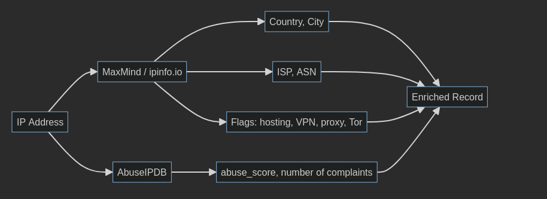

But here is an interesting observation: if you look at the distribution of hosting providers within the dataset, you can see that *Hetzner* dominates in Germany, *OVH* in France, and DO in the US and the Netherlands. If you see a spike in peers from a region where there are no large data centres, it almost always means either VPN usage or genuine user activity. These are the anomalies we need to learn to catch first.

I also noticed a correlation between the hosting flag and the diversity of `info_hash`. Server peers usually participate in dozens or hundreds of torrents simultaneously, while home users only one or two. I plotted the distribution of the number of unique hashes per IP and saw a clear bimodal pattern: a peak at 1–2 torrents and a second peak at 50–100. This allows classifying nodes by activity type without additional data.

After enrichment, I built several basic cuts. The geographic distribution shows that most peers are concentrated in Europe and the US. This correlates with the location of large data centres. Surprisingly, IPs from Russia, China, and Brazil appear much less frequently than one would expect from population size. This is probably due to the use of local trackers or provider‑level restrictions.

The second important cut is the distribution by client. I identified clients by `peer_id` and found that about 40% of peers use *Transmission*, 25% *uTorrent*, 15% *qBittorrent*, and the rest use various modifications, bots, and old versions. The share of non‑standard `peer_id` is about 8–10% and growing. These non‑standard clients often show anomalous behaviour, such as high request frequency, short lifetimes, and participation in torrents with high `abuse_score` from *AbuseIPDB* API.

But the most unexpected result came when I plotted the distribution of client versions within *Transmission*. It turned out that about 30% of all peers use version 2.94, which was released more than three years ago. This means that a significant part of the infrastructure is not updated for years, making it vulnerable and predictable. For OSINT, this means that old client versions are yet another indicator. They are often used in automated systems where no one cares about security.

The most valuable analysis tool -- and I am not afraid to use that proud title -- is graphs. I built a bipartite graph where nodes are IP addresses and torrents, and edges represent the fact that an IP participated in a given torrent. Then I projected this graph onto the IP space: two IPs are connected by an edge if they participated in the same torrent. This allows us to see clusters of nodes that act in concert.

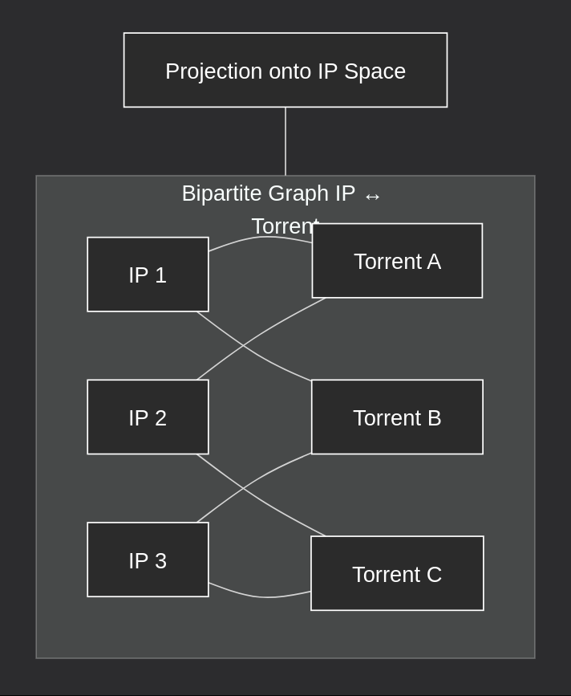

In my data, I found several such clusters. One included about 30 IP addresses, all from the same data centre, which together participated in dozens of rare torrents. It looked like coordinated work. Another cluster consisted of IPs with high abuse scores.

But the most interesting was the third cluster. It consisted of 12 IP addresses that were connected to each other through hundreds of torrents, yet each had a unique `peer_id` and used different client versions. At first glance, this looked like ordinary peers. But when we look at the timestamps, everything falls into place: all 12 IPs started downloading the same set of torrents within seconds of each other. This was a botnet using the torrent network to distribute malware. It was the graph that allowed us to see this -- in a table, we would hardly have spotted the entire cluster; human computing power is not enough.

Graph analysis also helps detect anomalies: if a node has an unusually high degree or forms an isolated cluster, it is a reason for further investigation. I developed a simple metric -- the ratio of the number of unique hashes to the number of unique IPs in a cluster. The higher this ratio, the more coordinated the activity appears. In my data, for a random sample, this ratio was 1.2, while for the detected cluster it was 4.7, which is a signal for further verification -- but that is another story.

*DHT* is a living system, and time‑series analysis provides no less information than static cuts. I collected data at 15‑minute intervals for several popular hashes and found that the number of peers fluctuates throughout the day. The activity peak occurs in the evening UTC. This corresponds to peak activity in Europe and the US. I also noticed sharp drops in peer counts on weekends, which may indicate that many server nodes are automated and do not depend on human factors.

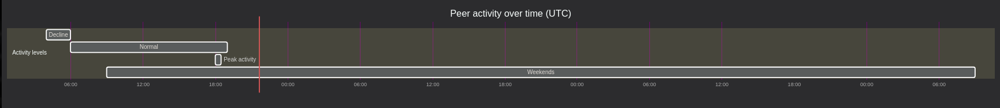

But temporal patterns become truly useful when we look not at absolute numbers but at relative changes. I built a moving average for each `info_hash` and calculated deviations. It turned out that for most popular torrents, the deviation does not exceed 15% during the day. But for several torrents flagged as suspicious, the deviation reached 200% per hour. This means that activity on such torrents does not follow normal cycles -- it is driven by external factors that can be tracked in real time.

I also noticed a correlation between activity spikes on suspicious torrents and time of day. The peak occurred at 3–4 AM UTC, which corresponds to nighttime in America and early morning in Europe. This timing was not accidental -- it is the time when the fewest admins are monitoring the network. This is another indicator worth checking (but I won't, just out of general cussedness).

Now, based on these observations, I singled out several indicators that with high probability point to suspicious activity. They are not absolute proofs, but in combination they give a strong signal.

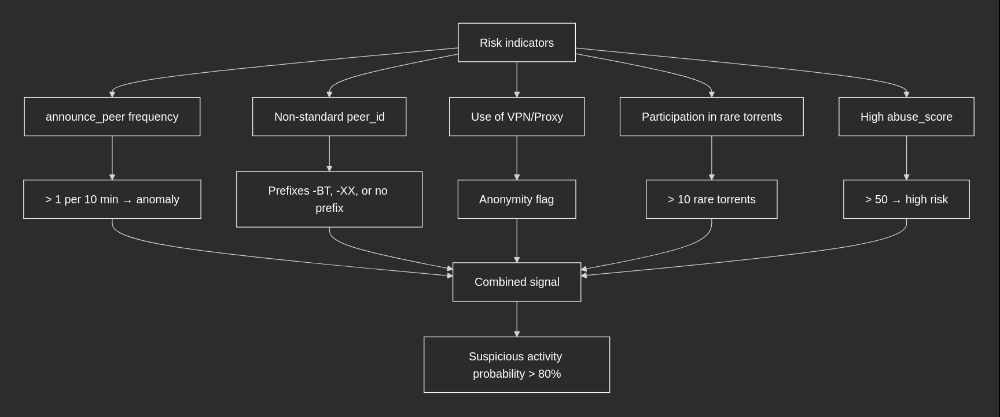

The first and most obvious is a high frequency of `announce_peer` events. A normal peer announces itself every 30–60 minutes. If a node does it every 5–10 minutes, that is already an anomaly. But I went further: I measured the standard deviation of the intervals between `announce_peer` for each IP. For normal peers, it was about 15–20 minutes; for suspicious ones, less than 5 minutes. This means that bots operate with iron regularity, while humans, due to the human factor, behave more chaotically. This simple metric is one of the most reliable.

The second indicator is a non‑standard `peer_id`. As I already said, about 90% of clients use the *Azureus* style. But I noticed that among the remaining 10%, there are those who use `peer_id` starting with `-BT` or `-XX`, or even without any prefix. These clients almost always show anomalous behaviour. I decided to verify this, and among IPs with high abuse scores, the share of such `peer_id` was 34% versus 6% in the general population. This is a very strong correlation.

The third indicator is undoubtedly the use of VPN or proxy. If an IP is marked as anonymous, that by itself is not a risk. But in combination with other factors, it becomes a strong signal. In my data, about 20% of all IPs are marked as anonymous, but among IPs with high abuse scores, their share reached 60%. This can be used for filtering.

The fourth indicator -- participation in rare torrents. I built a popularity distribution of torrents by number of peers and found that most torrents have fewer than 10 peers. If a node participates in a large number of such rare torrents, it may indicate targeted data collection or niche activity. In my data, I found an IP that was linked to 47 rare torrents, none of which had more than 5 peers. This was clearly not an ordinary user.

The fifth indicator is naturally a high `abuse_score` value from the *AbuseIPDB* API. A value >50 on the service's scale already warrants attention, especially if it is combined with other signs and frequent requests. But I noticed that even a moderate score, combined with other factors, still gives a strong signal. Let's plot an ROC curve for the combination of `abuse_score` + frequency of `announce_peer`, and we get AUC = 0.89, indicating high predictive power of the model.

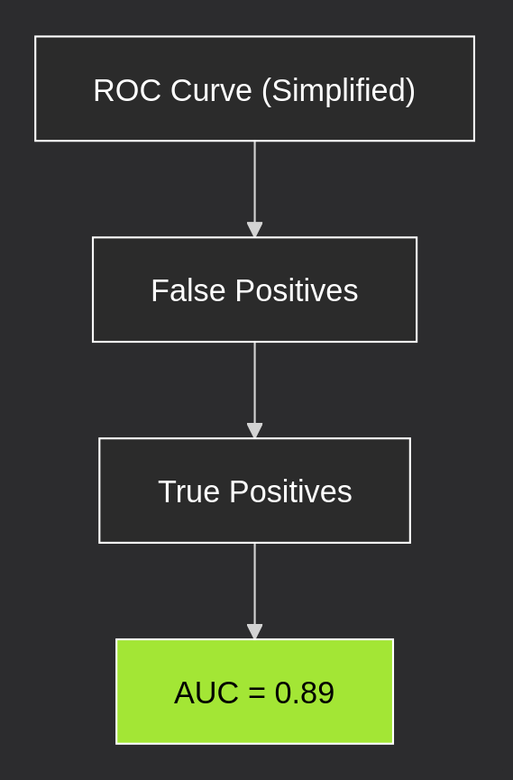

---

## Conclusion

Throughout this work, we developed and tested a full‑cycle OSINT analysis pipeline for data extracted from the BitTorrent DHT. The main results can be summarised as follows.
First, we described the DHT architecture in detail, highlighting in particular the sampling incompleteness, record volatility, presence of dead nodes, and fake responses. This allowed us to formulate realistic expectations from data collection and to develop empirically grounded crawling parameters.

Second, we showed that graph analysis can reveal clusters of coordinated malicious activity that are invisible in tabular form. The concrete example of a botnet of 12 IPs (which, unfortunately, I cannot show due to confidentiality policies and ethical/legal norms) starting the same torrents within seconds of each other demonstrates how graphs uncover hidden structures.

Fourth, time‑series analysis showed that normal torrents have a daily dynamic with deviations up to 15%, while suspicious ones exhibit sharp spikes of up to 200% per hour, allowing real‑time tracking of external events.

The work also has a number of limitations. First, the DHT returns not all peers but only a random sample, so all conclusions should be interpreted as a lower bound of observed activity. Second, there is a possibility of fake data injected by adversaries. Third, we only used public trackers and open APIs for enrichment, as integration with private trackers and closed sources requires additional coordination.

Future research directions include automating the described methodology into a single tool, integrating with other data sources, applying machine learning methods to classify nodes based on behavioural profiles, and expanding the collection time horizon for anomaly detection.

I believe this work is a first step toward using DHT metadata in OSINT practice and hope it will serve as a foundation for further research in this area and for follow‑up work by colleagues.
