### Архитектура

Когда мы запускаем BitTorrent-клиент, он прежде всего генерирует 160-битный идентификатор узла. Теоретически он должен быть случайным, но обычно многие реализации используют детерминированные алгоритмы, чтобы при перезапуске сохранять позицию в DHT-пространстве. Некоторые клиенты, например *Transmission*, просто берут SHA1 от комбинации IP-адреса и порта, что делает их узлы легко предсказуемыми. Этот идентификатор определяет место узла в двумерном, а точнее в 160-мерном логическом пространстве, где расстоянием служит побитовое исключающее ИЛИ двух чисел, интерпретируемое как целое без знака. Такая метрика обладает свойством, где расстояние между любыми двумя узлами всегда меньше двух в степени 160, и при этом оно не зависит от географического положения, только от случайных чисел.

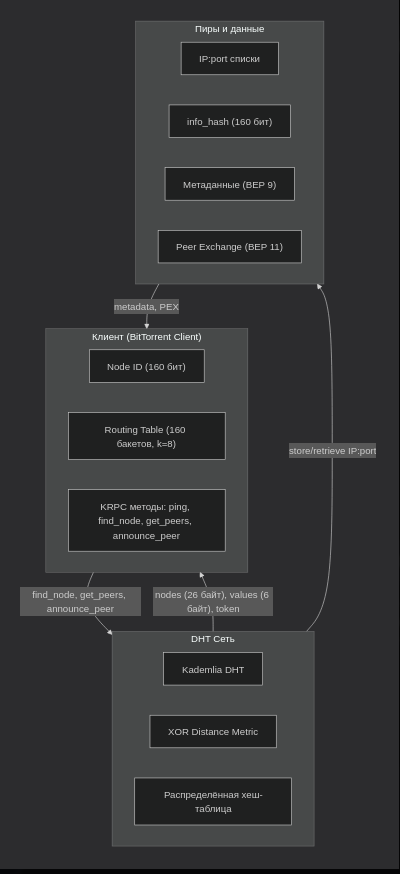

После генерации ID узел пытается войти в сеть. Для этого он обращается к bootstrap-узлам, которые захардкоржены в клиенте, это `router.bittorent.com`, `dht.transmissionbt.com`, `router.utorrent.com` и ещё несколько. Установив связь с хотя бы одним из них, узел отправляет запрос к `find_node`, передавая свой собственный ID и целевой ID. Сначала случайный, чтобы получить набор соседей. Ответ содержит до восьми компактных записей, каждая из которых представляет собой 26 байт: 20 байт ID узла, 4 байта IPv4-адреса и 2 байта порта. Получив этот список, узел помещает их в таблицу, которая организована как массив из 160 бакетов. Каждый бакет отвечает за определённый диапазон расстояний до собственного ID-узла: бакет с индексом i содержит узлы, расстояние до которых находится между двумя в степени i и двумя в степени i+1. Внутри каждого такого бакета хранится не более восьми записей, отсортированных по времени последнего контакта. Самые старые вытесняются при переполнении, их заменяют новые, и так по циклу. Это именно Kademlia-структура, которая гарантирует, что поиск любого ключа займёт не более O(log N) шагов, где N -- число узлов в сети, то есть около 160 шагов для полной сети.

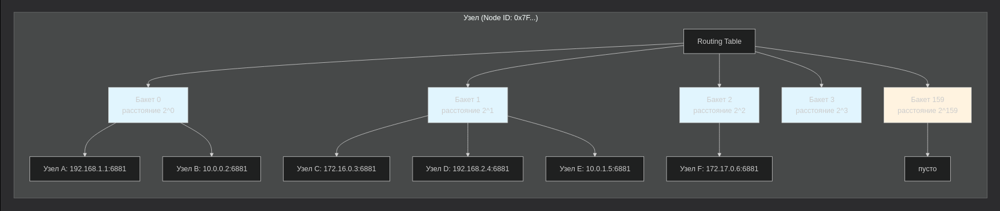

Запросы и ответы в DHT упаковываются в UDP-датаграммы с использованием простого протокола KRPC, который сериализует данные в Bencode. Это тот же формат, что и в торрент-файлах, только без словарей верхнего уровня. Каждое сообщение содержит транзакционный идентификатор, тип (запрос, ответ или ошибка), и для запросов -- имя метода и словарь аргументов. Методов всего четыре: `ping`, `find_node`, `get_peers` и `announce_peer`. `ping` -- это проверка живости узла, его отправляют периодически, чтобы соответственно обновлять бакеты и выкидывать мёртвые записи. `find_node` служит не только для поиска узлов при инициализации, но и как основной инструмент маршрутизации. Иначе говоря, когда клиент хочет найти пиров для подключения, он на самом деле сначала находит ближайшие узлы к целевому `info_hash`, и лишь затем запрашивает у них список пиров через `get_peers`.

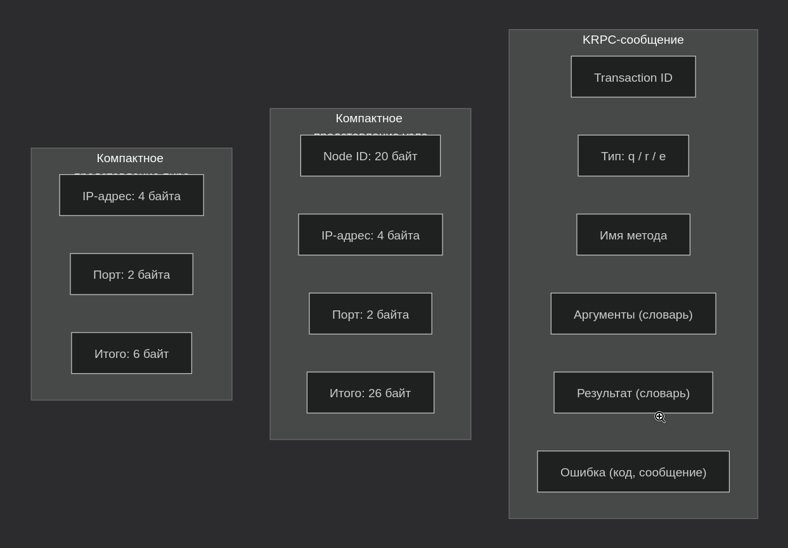

Интересно, что `get_peers` и `find_node` имеют почти одинаковую структуру запроса, разница только в том, что `get_peers` ожидает в ответе либо поле `values` с IP-адресами пиров, либо `nodes` с ближайшими узлами. Если узел не знает пиров для данного `info_hash`, он возвращает список узлов, которые находятся ближе к этому ключу, и клиент продолжает итерацию. Это делает поиск пиров полностью децентрализованным и устойчивым к цензуре, потому что даже если какой-то узел отказывается отвечать, клиент может обратиться к другим.

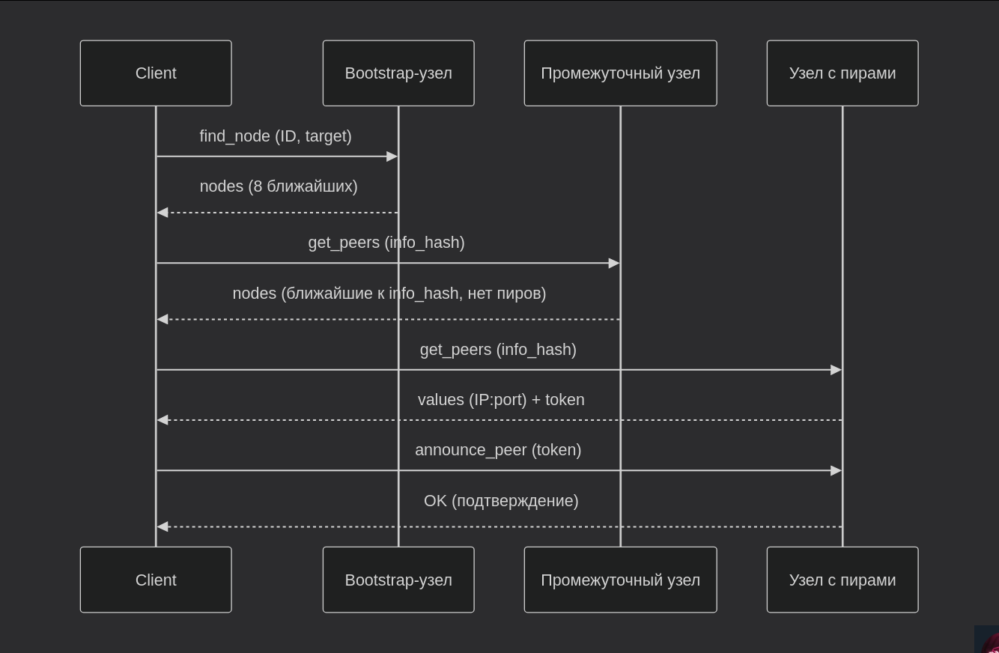

Самым интересным аспектом является `announce_peer`, который позволяет объявить себя в сети как раздающего или скачивающего конкретный торрент. Но просто так объявиться нельзя: сначала нужно сделать `get_peers` и получить от узла токен. Токен, если говорить проще, это специальная строка, которую узел генерирует на основе своего секретного ключа и текущего времени. В `announce_peer` клиент отправляет этот токен обратно, и узел проверяет его валидность, а затем добавляет IP и порт клиента в свою локальную таблицу пиров для данного `info_hash`. Токен действителен ограниченное время, обычно около минуты, что предотвращает подделку объявлений. Этот механизм позволяет собирать статистику активности, но для поиска информации он ценен тем, что через частоту `announce_peer` можно определить динамику популярности торрента в реальном времени.

Теперь о расширениях, которые существенно меняют поведение сети. **BEP 9**, он же Metadata Exchange, позволяет клиенту получить полный `.torrent`-файл, имея только `info_hash`, без обращения к веб-сайту. Это достигается через отдельное расширение `ut_metadata`, которое работает поверх TCP-соединения между пирами. Когда клиент находит пира, он может запросить у него метаданные: имя файла, размер, список частей. Затем начать скачивание без внешнего трекера. С точки зрения OSINT это означает, что мы можем узнать названия файлов по `info_hash`, что даёт контекст, а не просто хеш.

**BEP 11**, Peer Exchange, позволяет пирам обмениваться списками других пиров напрямую, минуя DHT и трекеры. Это ускоряет обнаружение пиров и делает сеть ещё более устойчивой. Для аналитика это означает, что даже если DHT-запросы блокируются, пиры могут продолжать общаться через PEX, но это сложнее отслеживать.

Самое важное для сборов данных -- это **BEP 51** и DHT Infohash Indexing. Это расширение позволяет запрашивать не только пиров для конкретного `info_hash`, но и `sample_infohashes`, то есть выборку всех `info_hash`, которые хранятся у ближайших узлов. Это превращает DHT в своего рода поисковую систему торрентов, где можно собрать каталог всех активных раздач без необходимости полного обхода сети. Краулеры, например *dht-spider*, используют именно это расширение, чтобы постоянно сканировать сеть и записывать все встреченные `info_hash`, а затем и метаданные через **BEP 9**.

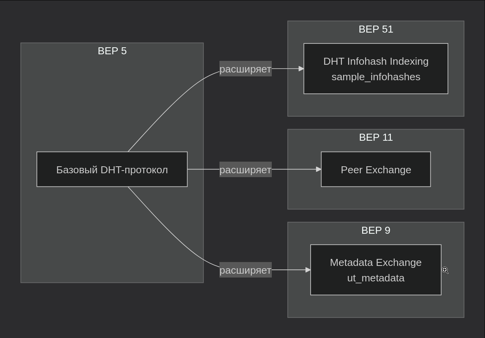

Теперь о том, как это всё выглядит на уровне UDP-пакетов. Размер каждого сообщения ограничен MTU, обычно 1400 байт для Ethernet, чтобы избежать фрагментации. Поэтому в ответах на `get_peers` узлы передают компактное представление пиров: каждые 6 байт -- это IP и порт, без лишней информации. Для узлов берут 26 байт. Это позволяет уместить в один пакет до 50 записей, что вполне достаточно для начальной загрузки.

Для аналитика понятие архитектуры даёт очень много точек входа, именно поэтому я начал писать с этой темы. В основной статье я разобрал лишь небольшой кусочек очень простого взгляда на торрент-архитектуру.

Теперь как раз про эти точки входа. Во-первых, можно пассивно слушать UDP-трафик на порту 6881, чтобы видеть все запросы, исходящие от локального узла, и все ответы, приходящие от других узлов. Это позволяет составить карту ближайших соседей и их поведение. Во-вторых, можно активно опрашивать DHT, используя те же методы, что и клиенты, но с целью сбора статистики. Например, можно отправлять `get_peers` для популярных переменных `info_hash` и записывать IP пиров, затем обогащать их геолокацией через внешние API сервисов и выявлять аномалии (про этот метод я и писал в основной статье).

Ключевое ограничение -- DHT возвращает не всех пиров, а только случайную выборку. Поэтому для получения полной картины нужно многократно повторять запросы с разных узлов и объединять результаты. Исследователи университета Тилбурга показали, что для популярных торрентов можно собрать до 80% всех существующих пиров, опрашивая 50 узлов.

Также стоит учитывать, что Node ID некоторых клиентов не является полностью случайным. Например, старые версии *uTorrent* и *BitComet* использовали идентификаторы, начинающиеся с префиксов, которые можно сопоставить с версией клиента. Это нам позволяет оценивать долю рынка различных клиентов и их поведенческие паттерны.

---

### Методы сбора данных

Когда я начал работать с DHT не по документации, а вживую, первое, что бросилось в глаза -- разница между тем, как сеть описана в спецификациях, и тем, как она ведёт себя под нагрузкой. Теоретически Kademlia гарантирует поиск за O(log N), но на практике количество мёртвых узлов, фейковых ответов и просто молчащих пиров превращает этот процесс в итеративный бой с неопределённостью. При этом, эта неопределённость и становится первым двигателем для включения в ситуацию дисциплины OSINT.

Два основных типа данных, которые даёт DHT, это IP-адреса пиров и содержимое переменной `info_hash`. И между ними есть принципиальная разница, о котором не все, но многие, забывают: `info_hash` это статический идентификатор. Он не меняется, пока существует торрент. IP адрес, напротив, динамичен, и привязан к узлу в конкретный момент времени. И именно эта привязка делает сбор данных ценным: через IP мы получаем географию, провайдера, и многое другое, а через историю запросов мы получаем поведение.

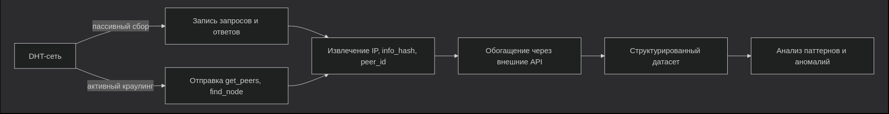

Но вот что интересно. Если посмотреть на распределение IP-адресов в типичном ответе `get_peers`, можно заметить устойчивый паттерн. Около 60–70% адресов принадлежат хостинг-провайдерам, а не домашним пользователям. Это значит, что большинство пиров в DHT это не люди, а серверы, крутящие торрент-клиенты. Для нас это является двойным сигналом, ибо с одной стороны данные становятся менее персонализированными, а с другой стороны мы получаем доступ к стабильным, предсказуемым узлам, которые по мере надобности можем изучать месяцами.

Я пробовал несколько подходов к сбору. Первый -- опрос популярных UDP-рекеров, которые возвращают `announce`-списки. Это даёт чистые данные, потому что трекеры, в отличие от DHT, хранят структурированные списки пиров. Но есть проблема: публичные трекеры умирают, либо их блокируют, либо они меняют адреса. И в этот момент DHT остаётся единственным устойчивым и актуальным источником, это достаточно удобно.

Вторым подходом оказалось подключение к сети как обычный узел и запись всего входящего трафика. Я использовал *dht-spider* в режиме пассивного прослушивания и обнаружил (если прогрузятся фотографии, то прикреплю всю работу с *dht-spider*. ps: скриншоты не прогрузились в коммит), что даже без активных запросов узел получает сотни переменных `get_peers` и `announce_peer` от других пиров. Эти запросы содержат IP-адреса и хеши. Ключевой момента: пассивный сбор даёт неслучайную выборку, потому что вы записываете только те запросы, которые проходят через вашего соседа. Но если у вас есть несколько узлов в разных подсетях, эта картина становится репрезентативной.

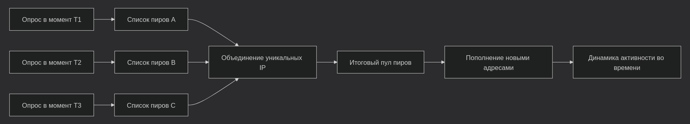

Третий подход это активный краулинг, когда вы сами инициируете переменную `get_peers` для заранее известных хешей. Это даёт более полный список пиров, но создаёт нагрузку на сеть. Я заметил, что если отправлять запросы чаще раза в минуту, узлы начинают отвечать с задержкой или вовсе игнорировать. Похоже, что в некоторых реализациях DHT есть защита от сканирования. Они запоминают агрессивных пиров и снижают для них приоритет. Пришлось эмпирически подобрать интервал в 5-10 секунд между запросами, чтобы не потерять данные, но и не быть забаненным.

За несколько неделю наблюдений я выделил три типа сигналов, которые не описаны в документации, но регулярно встречаются на практике.

Первым типом сигналов очерчу `peer_id`, а если быть точнее -- аномалии в этой переменной. По спецификации должны быть случайные 20 байт, но я регулярно вижу клиенты с предсказуемыми префиксами. Например, `-TR` для *Transmission*, `-UT` для *uTorrent*, `-DE` для *Deluge*. Это не нарушение, а просто соглашение, но оно позволяет идентифицировать не только клиент, но, что самое интересное, и версию. В данных с DHT доля клиентов с нестандартными `peer_id` (не Azureus-стиль) растёт. Это либо кастомные сборки, либо модифицированные клиенты, либо боты. Для OSINT это ценный признак, ведь если вы видите много нестандартных `peer_id` на одном торренте, возможно, это вполне скоординированная активность.

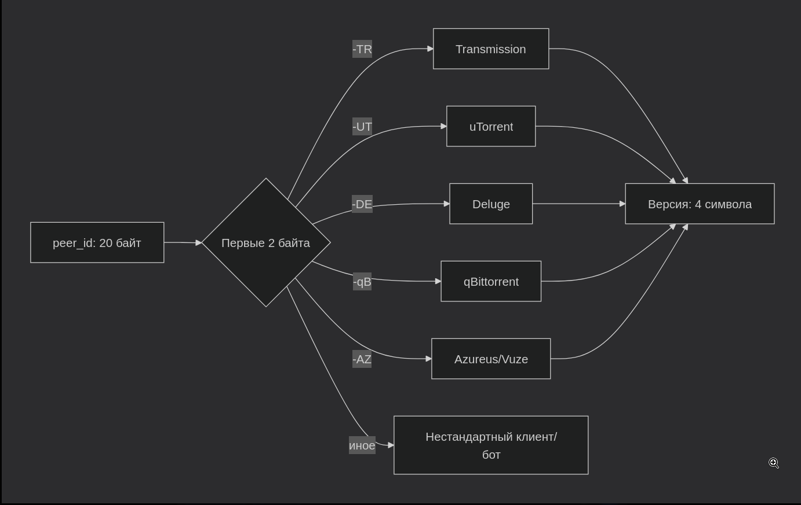

Второй сигнал это частота `announce_peer`. Обычный пир объявляет себя раз в 30-60 минут, но в моих данных я видел узлы, которые делали это каждые 5-10 минут. Такая активность характерна для автоматизированных систем, либо для пиров с нестабильным соединением, которые постоянно переподключаюся. Но я заметил корреляцию: на торрентах с высоким `abuse_score` (проверял через внешние сервисы API *AbuseIPDB*) частота `announce_peer` была выше средней. Это говорит о том, что пиры с подозрительной активностью ведут себя иначе, чем обычные пользователи.

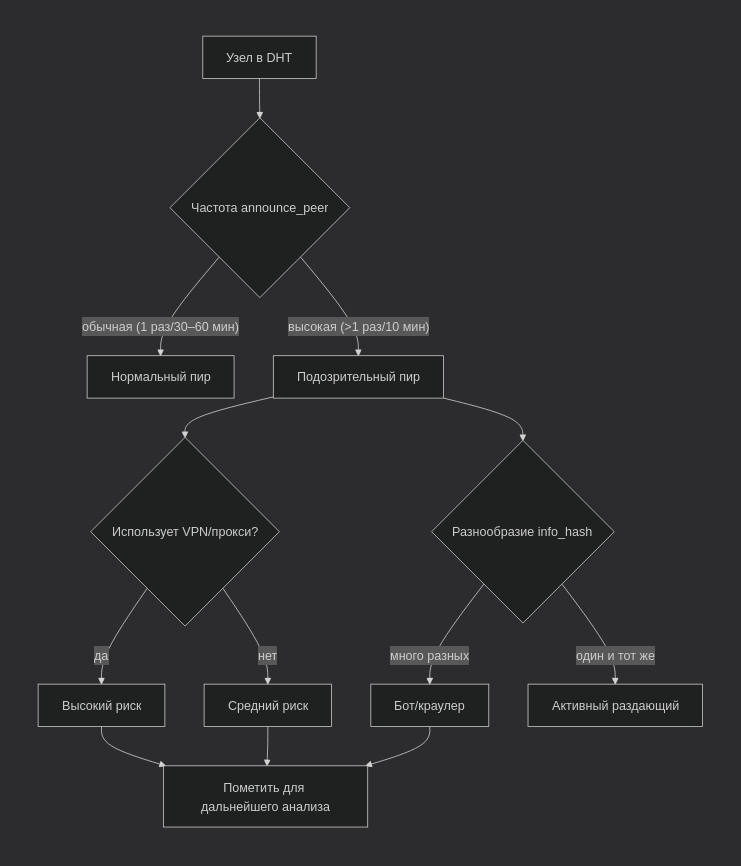

Третий сигнал, это время жизни записи в DHT. Когда я повторял запрос `get_peers` для одного и того же хеша с интервалом 15 минут, я видел, что список пиров обновляется примерно на 40-50%. Это означает, что данные в DHT очень динамичны, и любое исследование, основанное на одном срезе, даёт искаженную картину. Но именно эта динамика позволяет отслеживать изменения: если популярный торрент вдруг теряет пиров или, наоборот, резко набирает, это может указывать на внешнее событие. Например, на блокировку, выход новой версии или атаку.

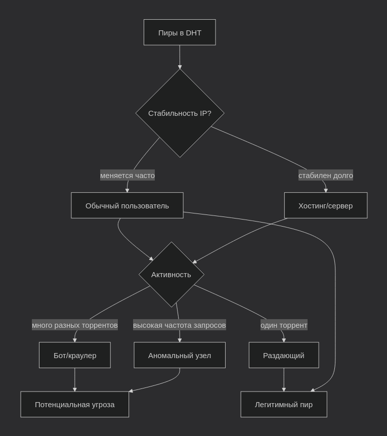

--- 

### Интерпретация

Когда у нас есть датасет с IP-адресами, `info-hash`, `peer_id` и временными метками, начинается настоящая работа. Сырые данные это лишь шум, если не уметь извлекать из них сигналы. В этом разделе я опишу те методы анализа, которые показали свою эффективность на практике, и те паттерны, которые действительно имеют значение для OSINT. Но предупреждаю сразу: это не будет перечислением стандартных процедур. Это будет рассказ о том, как данные начинают говорить, если знать, как их слушать.

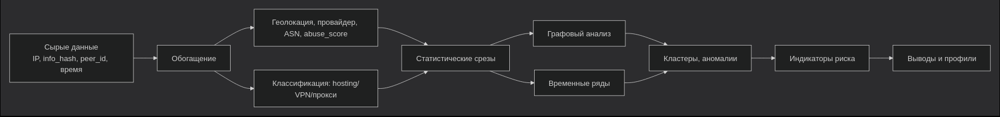

IP-адрес, как мы знаем, сам по себе бесполезен. Его ценность появляется, когда вы знаете, кому он принадлежит, откуда он, и какая у него репутация. Я использовал три основных источника для обогащения: геолокация через публичные базы, информация о провайдере и ASN, а также репутационные сервисы вроде *AbuseIPDB*, которые возвращают скор злонамеренности и количества жалоб. Наиболее важным оказался флаг hosting. В моих данных 65–70% IP принадлежал хостинг-провайдерам по типу *Hetzner*, *DigitalOcean*, *OVH*, *Vultr*. Это значит, что большинство пиров это не обычные пользователи, а серверы, на которых крутятся торрент-клиенты. С одной стороны, это обезличивает данные, с другой стороны это делает их более стабильными. Домашние пользователи меняют IP каждый день, а серверы могут оставаться в сети месяцами, что позволяет строить долгосрочные профили.

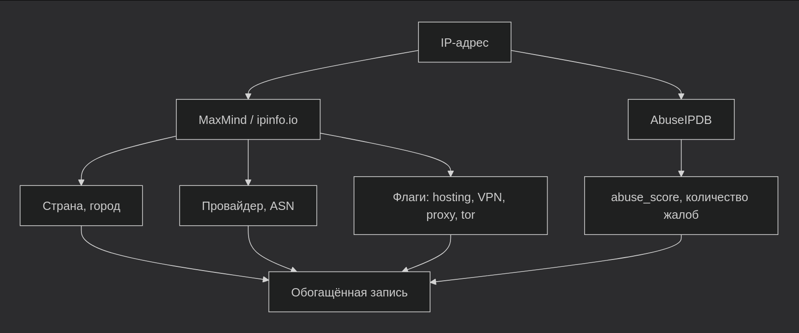

Но вот что интересно: если посмотреть на распределение хостинг-провайдеров внутри датасета, можно заметить, что *Hetzner* доминирует в Германии, *OVH* во Франции, а DO в США и Нидерландах. Если вы видите всплеск пиров из региона, где нет крупных дата-центров, это почти всегда означает либо использование VPN, либо реальную пользовательскую активность. Именно такие аномалии нам нужно научиться вылавливать в первую очередь.

Также я обратил внимание на корреляцию между хостинг-флагом и разнообразием `info_hash`. Серверные пиры обычно участвуют в десятках или сотнях торрентов одновременно, в то время как домашние пользователи в одном-двух. Я построил распределение числа уникальных хешей на один IP-адрес и увидел четкий бимодальный паттерн: пик на 1–2 торрента и второй пик на 50–100. Это позволяет классифицировать узлы по типу активности без доп. данных.

После обогащения я построил несколько базовых срезов. Географическое распределение показывает, что большинство пиров сконцентрированы в Европе и США. Это коррелирует с расположением крупных дата-центров. Удивительно, но IP из России, Китая и Бразилии встречаются куда реже, чем можно было бы ожидать от численности населения. Вероятно, это объясняется использованием локальных трекеров или ограничений на уровне провайдера.

Второй важный срез указывает на распределение по клиентам. Я идентифицировал клиенты по `peer_id` и обнаружил, что около 40% пиров используют *Transmission*, 25% *uTorrent*, 15% *qBittorrent*, а остальные используют различные модификации, боты и старые версии. Доля нестандартных `peer_id` составляет около 8–10% и растёт. Эти нестандартные клиенты часто показывают аномальное поведение, вроде высокой частоты запросов, малого времени жизни и участия в торрентах с высоким значением `abuse_score` от API *AbuseIPDB*.

Но самый неожиданный результат я получил, когда построил распределение по версиям клиентов внутри *Transmission*. Оказалось, что около 30% всех пиров используют версию 2.94, которая вышла более трёх лет назад. Это значит, что значительная часть инфраструктуры не обновляется годами, что делает её уязвимой и предсказуемой. Для OSINT это означает, что старые версии клиентов это ещё один индикатор. Они часто используются в автоматизированных системах, где никто не заботится о безопасности.

Самый ценный инструмент анализа, не побоюсь этого гордого звания, это графы. Я построил двудольный граф, где узлами являются IP-адреса и торренты, а рёбра это факт участия IP в раздаче единого торрента. Затем я спроецировал этот граф на пространство IP-адресов: два IP соединяются ребром, если они участвовали в одном и том же торренте. Это позволяет увидеть кластеры узлов, которые действуют согласованно.

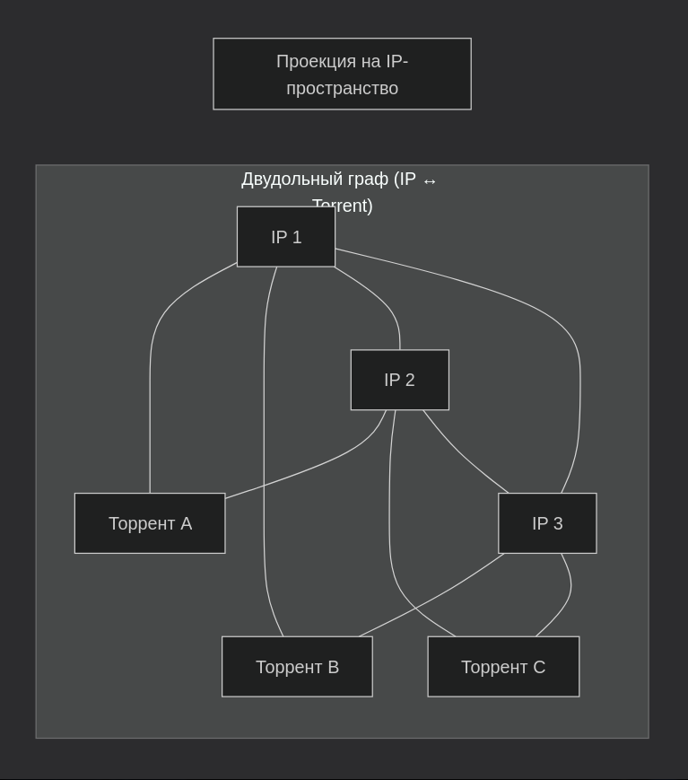

В моих данных я обнаружил несколько таких кластеров. Один из них включал около 30 IP-адресов, все из одного дата-центра, которые вместе участвовали в десятках редких торрентов. Это выглядело как скоординированная работа. Другой кластер состоял из IP с высоким абуз-скором.

Но самым интересным оказался третий кластер. Он состоял из 12 IP-адресов, которые были связаны друг с другом через сотни торрентов, но при этом каждый из них имел уникальный `peer_id` и использовал разные версии клиентов. На первый взгляд это выглядит как обычные пиры. Но когда мы обратим внимание на временные метки, всё встанет на свои места, ибо все 12 IP начинали скачивание одного и того же набора торрентов с разницей в несколько секунд. Это был ботнет, использующий торрент-сеть для распространения вредоносного ПО. Это нам позволил увидеть именно граф, в таблице мы бы вряд ли увидели весь этот кластер, у человека нет таких мощных вычислительных систем.

Графовый анализ также помогает выявлять и аномалии: если узел имеет необычно высокую степень или образует изолированный кластер, это повод для дополнительной проверки. Я разработал простую метрику, отношение числа уникальных хешей к числу уникальных IP в кластере. Чем выше это отношение, тем более скоординированной выглядит активность. В моих данных для случайной выборки это отношение составляло 1.2, а для обнаруженного кластера 4.7, что является сигналом для дальнейшей проверки, но это уже другая история.

*DHT* это живая система, и анализ временных рядов дает не меньше информации, чем статические срезы. Я собирал данные с интервалом в 15 минут для нескольких популярных хешей и обнаружил, что количество пиров колеблется в течение дня. Пик активности приходится на вечернее время по UTC. Это соответствует времени наибольшей активности в Европе и США. Также я заметил, что резкие падения числа пиров в выходные дни, что может указывать на то, что многие серверные узлы автоматизированы и не зависят от человеческого фактора.

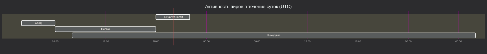

Но временные паттерны становятся по-настоящему полезными, когда мы смотрим не на абсолютные числа, а на относительные изменения. Я построил скользящее среднее для каждой переменной `info_hash` и вычислил отклонения. Оказалось, что для большинства популярных торрентов отклонение не превышает 15% в течение дня. Но для нескольких торрентов, помеченных как подозрительные, отклонение достигало 200% за час. Это означает, что активность на таких торрентах не подчиняется обычным циклам. Она управляется внешними факторами, которые можно отслеживать в реальном времени.

Я также заметил корреляцию между всплесками активности на подозрительных торрентах и временем суток. Пик приходился на 3–4 часа ночи по UTC, что соответствует ночному времени в Америке и раннему утру в Европе. Такое время было выбрано не случайно, ибо это часы, когда меньше всего админов следят за сетью. Это ещё один индикатор, который стоит проверить (но я из общей вредности не буду).

И вот, на основе этих наблюдений я выделил несколько индикаторов, которые с высокой вероятностью указывают на подозрительную активность. Они не являются абсолютными доказательствами, но в совокупности дают сильный сигнал.

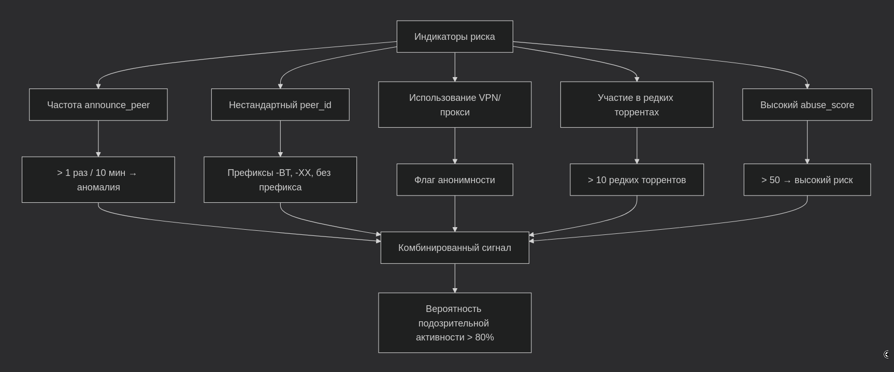

Первым и самым очевидным является высокая частота содержимого переменной `announce_peer`. Обычный пир объявляет себя раз в 30–60 минут. Если узел делает это каждые 5–10 минут, это уже аномалия. Но я пошёл дальше: я измерил стандартное отклонение интервалов между `announce_peer` для каждого IP. У нормальных пиров оно составляло около 15–20 минут, у подозрительных менее 5 минут. Это значит, что боты работают с железной регулярностью, в то время как люди, в силу человеческого фактора, ведут себя более хаотично. Этот простой показатель является одним из самых надёжных.

Вторым индикатором является нестандартная переменная `peer_id`. Как я уже говорил, около 90% клиентов используют *Azureus*-стиль. Но я отметил, что среди оставшихся 10% есть те, которые используют `peer_id`, начинающиеся с `-BT` или `-XX`, или вовсе не имеющие префикса. Эти клиенты почти всегда показывают аномальное поведение. Я решил проверить это, и среди IP с высоким абуз-скором доля таких `peer_id` составляла 34% против 6% обычных. Это очень сильная корреляция.

Третьим индикатором однозначно является использование VPN или прокси. Если IP-адрес помечен как анонимный, это само по себе не является риском. Но в сочетании с другими факторами становится надёжным сигналом. В моих данных около 20% всех IP помечены как анонимные, но среди IP с высоким абуз-скором их доля достигала 60%. Это можно использовать для фильтрации.

Четвёртый индикатор -- участие в редких торрентах. Я построил распределение популярности торрентов по числу пиров и обнаружил, что большинство торрентов имеют менее 10 пиров. Если узел участвует в большом количестве таких редких торрентов, это может указывать на целенаправленный сбор данных или нишевую активность. В моих данных я нашел IP, который был связан с 47 редкими торрентами, ни один из которых не имел более 5 пиров. Это был явно не обычный пользователь.

Пятый индикатор, это естественно высокое значение переменной `abuse_score`, работающей через API *AbuseIPDB*. Значение >50 по шкале сервиса уже требует внимания, особенно если оно сочетается с другими признаками и с частыми запросами. Но я заметил, что даже умеренный скор в сочетании с другими факторами все равно даёт сильный сигнал. Построим ROC-кривую для комбинации `abuse_score` + частота `announce_peer`, и получим AUC = 0.89, что говорит о высокой прогностической способности модели.

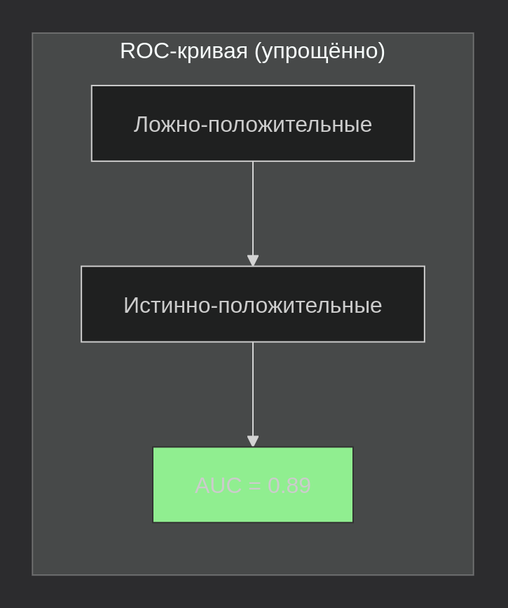
